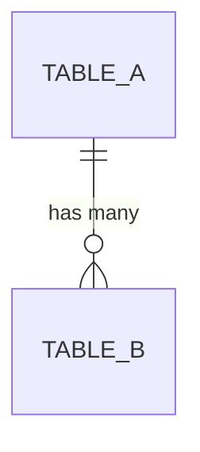

# Action: Generate ERD

Generate a visual Entity Relationship Diagram from the Solutions Intelligence KB schema data.

---

## When to Use

- "Show me the ERD"
- "Generate a database diagram"
- "Visualize the schema"
- "Show table relationships"
- "Create an ER diagram for Source Selection"

---

## Workflow

### Step 1: Get schema data
```
Solutions Intelligence MCP: solutions-intelligence.get_app_schema(app_name)
Solutions Intelligence MCP: solutions-intelligence.get_schema_relationships(app_name)
Solutions Intelligence MCP: get_schema_summary(app_name)
```

### Step 2: Determine scope

Ask or infer:
- **Full ERD** — all tables (can be large, 100+ tables)
- **Business tables only** — `classification="business"` (recommended default)
- **Specific entity** — one table + its direct relationships
- **By classification** — business, reference, audit, task_management

### Step 3: Generate the ERD

Choose output format based on user preference:

#### Option A: Mermaid (`.md` — renders in GitHub, VS Code)

````markdown

````

#### Option B: Draw.io (`.drawio` — editable in diagrams.net)

Generate a `.drawio` XML file. Each table is a shape with columns listed. Connections represent FK relationships.

**Draw.io XML structure:**

```xml
<mxfile>
  <diagram name="ERD">
    <mxGraphModel>
      <root>
        <mxCell id="0"/>
        <mxCell id="1" parent="0"/>
        <!-- Table: use shape="table" style -->
        <mxCell id="t1" value="TABLE_NAME" style="shape=table;startSize=30;container=1;collapsible=1;childLayout=tableLayout;fixedRows=1;rowLines=0;fontStyle=1;align=center;resizeLast=1;fillColor=#dae8fc;strokeColor=#6c8ebf;" vertex="1" parent="1">
          <mxGeometry x="40" y="40" width="200" height="120" as="geometry"/>
        </mxCell>
        <!-- Row: PK -->
        <mxCell id="t1r1" value="PK_ID" style="shape=tableRow;horizontal=0;startSize=0;swimlaneHead=0;swimlaneBody=0;fillColor=none;collapsible=0;dropTarget=0;points=[[0,0.5],[1,0.5]];portConstraint=eastwest;fontSize=12;fontStyle=4;" vertex="1" parent="t1">
          <mxGeometry y="30" width="200" height="30" as="geometry"/>
        </mxCell>
        <!-- Row: regular column -->
        <mxCell id="t1r2" value="COLUMN_NAME" style="shape=tableRow;horizontal=0;startSize=0;swimlaneHead=0;swimlaneBody=0;fillColor=none;collapsible=0;dropTarget=0;points=[[0,0.5],[1,0.5]];portConstraint=eastwest;fontSize=12;" vertex="1" parent="t1">
          <mxGeometry y="60" width="200" height="30" as="geometry"/>
        </mxCell>
        <!-- FK Connection -->
        <mxCell id="e1" style="edgeStyle=entityRelationEdgeStyle;endArrow=ERmandOne;startArrow=ERmany;" edge="1" source="t2r1" target="t1r1" parent="1">
          <mxGeometry as="geometry"/>
        </mxCell>
      </root>
    </mxGraphModel>
  </diagram>
</mxfile>
```

**Draw.io generation rules:**

1. **Table positioning** — arrange in a grid layout:
   - Parent tables on the left, children on the right
   - Space tables 250px apart horizontally, 180px vertically
   - Use topological order for left-to-right placement

2. **Table style** — use `shape=table` with:
   - Header: `fillColor=#dae8fc;strokeColor=#6c8ebf` (blue for business)
   - Header: `fillColor=#d5e8d4;strokeColor=#82b366` (green for reference)
   - `startSize=30` for header height
   - `fontStyle=1` (bold) for table name

3. **Row style** — use `shape=tableRow` with:
   - PK rows: `fontStyle=4` (underline)
   - FK rows: `fontStyle=2` (italic)
   - Regular rows: no fontStyle

4. **Connections** — use `edgeStyle=entityRelationEdgeStyle`:
   - One-to-many: `endArrow=ERmandOne;startArrow=ERmany`
   - Many-to-one: `endArrow=ERmany;startArrow=ERmandOne`
   - Connect from FK row of child to PK row of parent

5. **Column selection** — same as Mermaid: PK, FKs, key identifiers, isActive. Skip audit/description fields.

6. **ID scheme** — use `t{n}` for tables, `t{n}r{m}` for rows, `e{n}` for edges.

#### Option C: HTML (interactive — Mermaid JS in browser)

```html
<script src="https://cdn.jsdelivr.net/npm/mermaid/dist/mermaid.min.js"></script>
```

### Step 4: Save the file

---

## Mermaid ERD Syntax Rules

### Table definition
```
TABLE_NAME {
    type column_name constraint
}
```
- Constraints: `PK`, `FK`, `UK` (unique)
- Types: `int`, `varchar`, `date`, `datetime`, `boolean`, `decimal`, `text`

### Relationship notation
```
TABLE_A ||--o{ TABLE_B : "label"
```

| Symbol | Meaning |
|--------|---------|
| `\|\|` | Exactly one |
| `o\|` | Zero or one |
| `}o` | Zero or many |
| `}\|` | One or many |
| `\|\|--o{` | One to many |
| `\|\|--\|\|` | One to one |
| `}o--o{` | Many to many |

### Mapping FK relationships to notation
- ONE_TO_MANY: `PARENT ||--o{ CHILD`
- MANY_TO_ONE: `CHILD }o--|| PARENT`
- ONE_TO_ONE: `TABLE_A ||--|| TABLE_B`

---

## Scope Options

### Business tables only (default)
```
Solutions Intelligence MCP: solutions-intelligence.get_app_schema(app_name, classification="business")
Solutions Intelligence MCP: solutions-intelligence.get_schema_relationships(app_name)
```
Filter relationships to only those between business tables.

### Single entity focus
```
Solutions Intelligence MCP: solutions-intelligence.get_app_schema(app_name, table_name="AS_GSS_EVALUATION")
Solutions Intelligence MCP: solutions-intelligence.get_schema_relationships(app_name, table_name="AS_GSS_EVALUATION")
```
Show the target table + all directly related tables.

### Full application
Use all tables. Group by classification using Mermaid comments for readability.

---

## Column Selection for ERD

Don't show ALL columns — ERDs become unreadable. Show:
- Primary key (always)
- Foreign keys (always)
- Key identifying fields (name, title, status)
- `IS_ACTIVE` (important for understanding soft deletes)

Skip:
- Audit fields (createdBy, modifiedBy, createdDatetime, modifiedDatetime)
- Description/long text fields
- Internal fields (folderId, office365FolderId)

---

## Output

Save to:
- Mermaid: `<app_name>-erd.md`
- Draw.io: `<app_name>-erd.drawio`
- HTML: `<app_name>-erd.html`

**Default to Draw.io** unless user specifies otherwise — it's the most editable and shareable format.

### Show to user:
```
✅ ERD Generated
━━━━━━━━━━━━━━━━━━━━━━━━━━━━━━━━━━━━━━━━
Application: [name]
Scope: [business tables / full / single entity]
Tables: [count]
Relationships: [count]
File: [path]
━━━━━━━━━━━━━━━━━━━━━━━━━━━━━━━━━━━━━━━━
```
